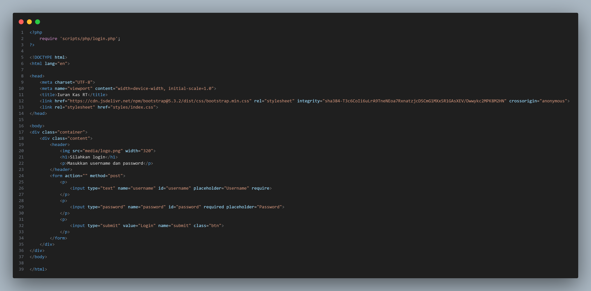

# 
 Project UAS Iuran Kas RT 

## 
 Kelompok 1 TI.22.A.3 

  

## 🚀 Anggota Kelompok 🚀  
| [Alif Nur Fathlii Amarta](https://github.com/Alifamarta) | [Chaerul Hidayat](https://github.com/ChaerulHidayat17) | [Hilman Ihza Amrullah](https://github.com/HilmanAmrullah) | 
|---------|---------|---------| 
| 312210326 | 312210300 | 312210310 |

## Kami akan menjelaskan detail dari program yang sudah kami buat
1. Tampilan Awal  
   Kami membuat menu login yang simpel dan elegan  
   
  Source Code nya  
  

2. Tampilan Dashboard  
   Untuk Dasboardnya kami sudah memunculkan 3 tools untuk memudahkan user untuk meng akses tools tersebut  
   
   Source Code nya  
   
   
3. Menu Sidebar Responsive di semua tools
   

4. Data Warga  
   Disini adalah tampilan semua data warga, untuk menampilkan semua data warga, kami menambahkan dengan tools Tambah Warga  
   
   Source Code nya  
   
